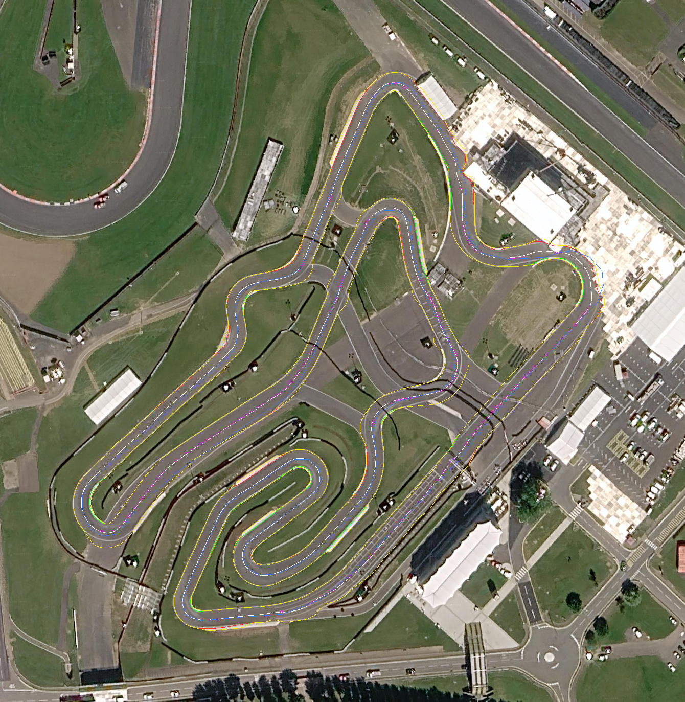

# Kart Silverstone — Grand Prix layout, 1:1, in the SnowCar

The **Grand Prix layout of Kart Silverstone** (1377 m, 18 corners; the FIA-CIK
karting circuit that opened in 2025 on the old Bridge–Priory infield of the
Silverstone Circuit) at true scale as a Trackmania 2020 Stadium map, driven in
the **SnowCar**, with the whole Silverstone venue of [the F1 map](../README.md)
around it as scenery — the 5.9 km Grand Prix circuit and every other piece of
tarmac, the terrain, the Wing, the grandstands.

The kart track post-dates every open survey (the newest LIDAR is 2019, the
track was laid in 2025), so unlike the F1 map its geometry does not come from
the ground scan. OpenStreetMap gives the topology (eleven `sport=karting`
ways, twelve junctions); the layout was read off three sources that agree —
the venue's own outline, Kart Directory's track map (the GP in blue, the
cut-throughs of the other four layouts in grey, the start/finish tick on the
main straight) and motorsport-timing.co.uk's sector map, which also gives the
direction (north-east along the main straight); and the centreline was then
**re-centred between the tarmac edges read off Google's 2026 zoom-20
imagery**, where the finished track, its white kerbs, the grid boxes and the
timing gantry are all visible. Result: 1382 m of lap (official 1377), widths
6–9 m on the track proper, 12 m and more across the movable-barrier plaza
where the layouts fork.

*(white: centreline, green/red: tarmac edges, yellow: kerbs, blue dashed: the
OSM centreline it started from; the pit lane along the tents is not part of the
lap.)*

| | |
|---|---|
| Map file | `KartSilverstone.Map.Gbx` (this folder), 12.2 MB, 525 items |
| Map uid | `SilverstoneKartae6c4212bbad` |
| Car | **SnowCar** (`<playermodel id="CarSnow"/>`, body chunk `0x0304300D`) |
| Lap | 1382 m, 8 checkpoints (one every ~150 m), spawn on the grid 30 m before the timing gantry, finish on the gantry line |
| Data | OSM (ODbL) for the topology and the venue; EA LIDAR DTM 2022 for the ground (OGL v3); Google imagery (viewed, not shipped) for the edges |
| Tool | [`tools/circuit build-kart`](../../tools/circuit/CIRCUIT.md) — Rust, one binary |
| Lap ghost | `ghost/KartSilverstone.lap.Ghost.Gbx` — **72.577 s**, 8/8 checkpoints, 0 rewinds, validated by the dedicated server (author time) |
| Filmable ghost | `ghost/KartSilverstone.lap.filmable.Ghost.Gbx` — same inputs, car telemetry regenerated from the engine, car model `CarSnow`; what the video shows |
| Video | [kart-silverstone-gp-lap-72577.mp4](https://github.com/vjeux/trackmania-tas/releases/download/videos-v1/kart-silverstone-gp-lap-72577.mp4) (1080p30, 1:13, controls overlay) |
| Nadeo | club campaign **Silverstone 1:1** (club 43788, campaign 155871, position 2, after the F1 map), map id `497064f7-9e7e-4739-bc7d-2629f88d90e9` — [campaign](https://trackmania.io/#/campaigns/43788/155871) · [leaderboard](https://trackmania.io/#/leaderboard/SilverstoneKartae6c4212bbad) |

Medals: author 1:12.577 · gold 1:18.380 · silver 1:27.090 · bronze 1:48.870.

## The lap

Start on the grid straight heading north-east, under the timing gantry, across
the plaza into the right-hander onto the loop (the far east end, next to the
paddock), out of the loop north to the Priory hairpin (left, the top of the
map), back south-west down the long return leg with its kink, into the Bridge
hairpin (the west end, on the old F1 Bridge corner tarmac), along the lower
arm, up the arm curve into the tight hairpin, out through the link and the
wiggle, into the double hairpin (the "e": two hairpins and a loop back to back)
and out onto the main straight. The SnowCar does the main straight at
129 km/h and the hairpins at 34–35 km/h.

## How it was made

`circuit build-kart` (see `tools/circuit/CIRCUIT.md`, section 9):

- the lap: the OSM junction-node sequence `kart::GP_NODES`, Catmull-Rom through
  the nodes, then three rounds of *read both edges off the imagery, move each
  station to their midpoint, rebuild*. Edges: the first run of ≥0.5 m of
  non-asphalt pixels walking out from the centre (grass, white kerb, dirt; a
  dark run only when grass follows it — barriers and shadows otherwise cross
  the road), kerb = the white run at the edge; stations whose width falls
  outside 5.2–12.5 m (junctions, the plaza) do not vote on the centre;
- the ground: the 2022 DTM under the centreline, smoothed over 15 m (the track
  was graded flat on a gently sloping site: 150.3–156.3 m ASL);
- the rest of the venue exactly as the F1 map builds it: the F1 lap becomes
  the first extra road (its own LIDAR edges), then every other raceway way of
  the venue, then the karting cut-throughs and the pit lane (imagery edges),
  each clipped against everything built before it and meeting the kart lap
  flush; terrain classified asphalt/grass from the 2019 intensity everywhere
  except within 50 m of the kart track, where the imagery decides; buildings
  and fences from OSM + DSM as before;
- the self-check on the kart lap (nothing above the tarmac or the kerbs, no
  holes, no launching crests) passes with one 3 cm verge-over-kerb note;
- the SnowCar: `tmmaps::MapFile::set_player_model("CarSnow", 10003, "Nadeo")`
  rewrites body chunk `0x0304300D` (its two strings open the body's lookback
  table, so the blocks and baked chunks are re-encoded with it) and the header
  XML. Spelled the way TMX 141984, a SnowCar map made in the game, spells it.

## The ghost lap

**72.577 s, 8/8 checkpoints, 0 rewinds**, validated by the Nadeo dedicated
server on this exact map file — details, splits and the driver's settings in
[`ghost/NOTE.md`](ghost/NOTE.md). The dedicated server simulates the map's
car: the same full-gas start reaches 147 km/h in the SnowCar where the stadium
car reaches 185, so the validation is a SnowCar validation.

## The video

The whole lap from the stock chase camera, rendered by the game from the
filmable ghost, with the controls overlay (gas / brake / steer) at the bottom
left:

https://github.com/user-attachments/assets/ff72cb80-e1f7-4f88-8dc9-630e9c95adf2

(release asset on the `videos-v1` release, 42 MB, fetched anonymously → 200:
https://github.com/vjeux/trackmania-tas/releases/download/videos-v1/kart-silverstone-gp-lap-72577.mp4)

## Nadeo

Uploaded to Nadeo's map service (stored bytes byte-identical to
`KartSilverstone.Map.Gbx` here, md5 `8faf45038bd0ef2a8dd165d597289239`) and
placed in the club campaign **Silverstone 1:1** of club 43788 (campaign
155871) right after the F1 map. In game: Live → Clubs → the club → Campaigns →
Silverstone 1:1 → map 2.
